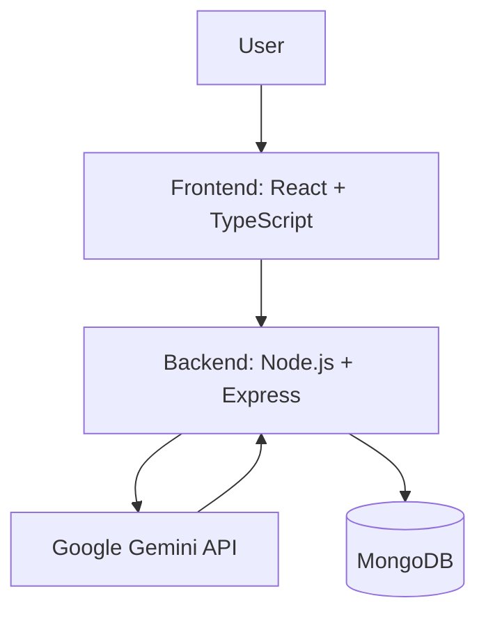

# Design Document

## Overview

This design document outlines the technical approach for implementing a Gemini-based chatbot application. The system will be built using React with TypeScript for the frontend, Node.js with Express for the backend, MongoDB for data storage, and Docker for containerization. The chatbot will leverage Google's Gemini API to provide intelligent responses to user queries.

## Architecture

The application follows a three-tier architecture:

1. **Frontend Layer**: React application with TypeScript
2. **Backend Layer**: Node.js Express server
3. **Data Layer**: MongoDB database

All components will be containerized using Docker and orchestrated with Docker Compose.



### Communication Flow

1. User enters a message in the frontend interface
2. Frontend sends the message to the backend API
3. Backend forwards the message to the Gemini API
4. Gemini API returns a response
5. Backend stores the conversation in MongoDB
6. Backend sends the response back to the frontend
7. Frontend displays the response to the user

## Components and Interfaces

### Frontend Components

1. **App Component**: Main application container
   - Manages application state
   - Renders the chat interface

2. **Chat Component**:
   - Displays message history
   - Provides input field for user messages
   - Handles sending messages to the backend

### Backend Components

1. **Express Server**:
   - Handles HTTP requests
   - Routes API endpoints
   - Manages middleware

2. **API Controller**:
   - Processes chat requests
   - Communicates with Gemini API
   - Stores conversation history in MongoDB

3. **Database Service**:
   - Manages connections to MongoDB
   - Handles CRUD operations for message storage

### API Interfaces

#### Backend API Endpoints

1. **POST /api/chat**
   - Request Body: `{ message: string }`
   - Response: `{ reply: string }`
   - Description: Sends user message to Gemini API and returns the response

#### Gemini API Integration

- Endpoint: `https://generativelanguage.googleapis.com/v1beta/models/gemini-pro:generateContent`
- Authentication: API Key
- Request Format:
  ```json
  {
    "contents": [
      {
        "parts": [
          {
            "text": "User message here"
          }
        ]
      }
    ]
  }
  ```
- Response Format:
  ```json
  {
    "candidates": [
      {
        "content": {
          "parts": [
            {
              "text": "AI response here"
            }
          ]
        }
      }
    ]
  }
  ```

## Data Models

### Message Schema

```typescript
{
  user: String,  // User's message
  bot: String    // Bot's response
}
```

## Error Handling

1. **API Error Handling**:
   - Implement try-catch blocks for all API calls
   - Return appropriate HTTP status codes and error messages
   - Log errors for debugging purposes

2. **Frontend Error Handling**:
   - Display user-friendly error messages
   - Implement retry mechanisms for failed API calls
   - Handle network connectivity issues gracefully

3. **Docker Error Handling**:
   - Implement health checks for containers
   - Configure appropriate restart policies
   - Log container errors for monitoring

## Testing Strategy

1. **Unit Testing**:
   - Test individual components in isolation
   - Mock external dependencies
   - Use Jest for JavaScript/TypeScript testing

2. **Integration Testing**:
   - Test API endpoints with actual requests
   - Verify database operations
   - Test communication between frontend and backend

3. **End-to-End Testing**:
   - Test the complete user flow
   - Verify Docker container orchestration
   - Test deployment configurations

## Deployment Strategy

1. **Development Environment**:
   - Local Docker Compose setup
   - Environment variables for configuration

2. **Production Environment**:
   - Docker containers deployed to cloud service
   - Proper security measures for API keys
   - Database backups and monitoring

## Security Considerations

1. **API Key Protection**:
   - Store API keys in environment variables
   - Never expose API keys in frontend code
   - Use backend as a proxy for Gemini API calls

2. **Data Security**:
   - Implement proper validation for user inputs
   - Sanitize data before storage
   - Consider encryption for sensitive data

3. **Container Security**:
   - Use official base images
   - Keep containers updated
   - Implement least privilege principle